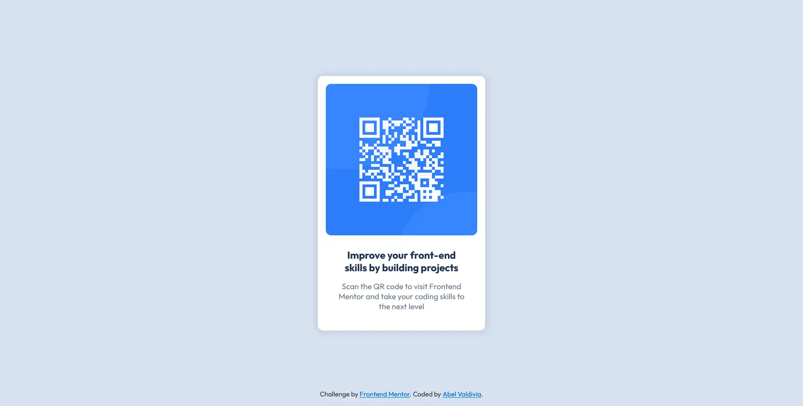

# Frontend Mentor - QR code component solution

This is a solution to the [QR code component challenge on Frontend Mentor](https://www.frontendmentor.io/challenges/qr-code-component-iux_sIO_H). Frontend Mentor challenges help you improve your coding skills by building realistic projects.

## Table of contents

-   [Overview](#overview)
    -   [Screenshot](#screenshot)
    -   [Links](#links)
-   [My process](#my-process)
    -   [Built with](#built-with)
-   [Author](#author)

## Overview

### Screenshot

### Links

-   Solution URL: [github.com/vdabel/qr-code-component](https://github.com/vdabel/qr-code-component)
-   Live Site URL: [vdabel.github.io/qr-code-component/](https://vdabel.github.io/qr-code-component/)

## My process

### Built with

-   Semantic HTML5 markup
-   CSS custom properties
-   Flexbox

## Author

-   Github - [vdabel](https://github.com/vdabel)
-   Frontend Mentor - [@vdabel](https://www.frontendmentor.io/profile/vdabel)
-   Linkedin - [Abel Enrique Valdivia Daza](https://www.linkedin.com/in/e-valdivia/)
